### Hi, I'm Anna. she/her.

I build software for a living and infrastructure for fun, which means I
have strong opinions about dependency graphs and a homelab that is one
`terraform apply` away from a very educational afternoon.

Lately that has meant
[reverse-engineering a keyboard's firmware](https://notjustanna.net/post/writing-software-for-my-keyboard/)
(25,000 lines of 8051 assembly) because I wanted to remap a key without
holding Fn, and then shipping [a web tool](https://sfphantom.notjustanna.net) so nobody else has to.
Before that, [I accidentally built a not-a-framework for JS](https://notjustanna.net/post/seamstack/)
because I dislike monorepos that much. Both are exactly as unhinged as they sound.

Before all of this I wrote [a compiler](https://github.com/NotJustAnna/Lin), [a parser library](https://github.com/NotJustAnna/tartar), and [a VM for
the language the compiler compiles to](https://github.com/NotJustAnna/leanvm). In my third semester of uni. For fun.
I mention it because it explains a lot.

I have opinions about [what a container image actually is](https://notjustanna.net/post/container-images-are-operating-systems/),
[why SQL survived every attempt to replace it](https://notjustanna.net/post/sql-is-not-fine/), and
[how far the AWS free tier can carry a real SaaS](https://notjustanna.net/post/design-constraints-as-art/).
My homelab is K3s in a container on a free-tier ARM box, run by ArgoCD, under one rule:
if it's not in the repo, it doesn't exist.

**Things I'll talk your ear off about:** reverse engineering · self-hosting · containers and what they
really are · Kotlin and TypeScript · why your orchestrator doesn't need more than one node · coffee

I write about all of the above (and whatever I'm currently breaking)
at **[notjustanna.net](https://notjustanna.net)**.

---

<!-- BLOG:START -->
<!-- updated automatically — don't touch -->
- [Discs Are Tarballs Now](https://notjustanna.net/post/discs-are-tarballs-now/)
- [The Internet Fits In Two Terabytes Now.](https://notjustanna.net/post/the-internet-fits-in-two-terabytes/)
- [Valve is a shitty company. We allow Valve to stay shitty.](https://notjustanna.net/post/valve-is-a-shitty-company/)
- [Container Images Are Operating Systems](https://notjustanna.net/post/container-images-are-operating-systems/)
- [You should pay for your Android launcher](https://notjustanna.net/post/you-should-pay-for-your-launcher/)
<!-- BLOG:END -->

---

  
  &nbsp;
  

